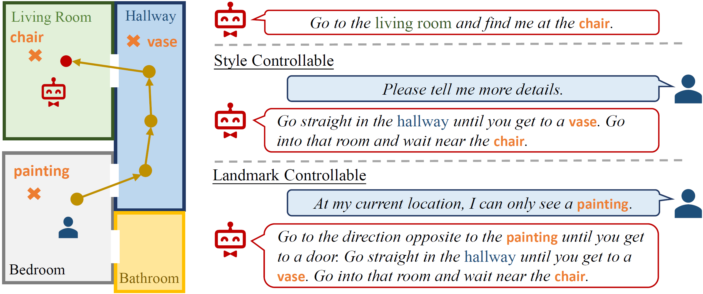

# C-Instructor: Controllable Navigation Instruction Generation with Chain of Thought Prompting

Official implementation of the **ECCV 2024** paper **Controllable Navigation Instruction Generation with Chain of Thought Prompting** [[Link]](https://www.ecva.net/papers/eccv_2024/papers_ECCV/papers/04155.pdf).

<div align="center"></div>

## News

- 12/16/2024: Initial release 🎉🎉🎉.

## Setup

We recommend using our [Dockerfile](docker/Dockerfile) to setup the environment. If you encounter any issues, please refer to [Matterport3D Simulator](https://github.com/peteanderson80/Matterport3DSimulator).

### Prerequisites

- Nvidia GPU with driver >= 396.37
- Install [docker](https://docs.docker.com/engine/installation/)
- Install [NVIDIA Container Toolkit](https://docs.nvidia.com/datacenter/cloud-native/container-toolkit/latest/install-guide.html)
- Note: CUDA / cuDNN toolkits do not need to be installed (these are provided by the docker image)

### Clone Repo

Clone the Matterport3D Simulator repository:

```bash
# Make sure to clone with --recursive
git clone --recursive https://github.com/peteanderson80/Matterport3DSimulator.git
cd Matterport3DSimulator
```

If you didn't clone with the `--recursive` flag, then you'll need to manually clone the pybind submodule from the top-level directory:

```bash
git submodule update --init --recursive
```

### Dataset Download

To use the simulator you must first download the [Matterport3D Dataset](https://niessner.github.io/Matterport/) which is available after requesting access [here](https://niessner.github.io/Matterport/). The download script that will be provided allows for downloading of selected data types. At minimum you must download the `matterport_skybox_images` and `undistorted_camera_parameters`. If you wish to use depth outputs then also download `undistorted_depth_images` (not required for C-Instructor).

Set an environment variable to the location of the **unzipped** dataset, where `<PATH>` is the full absolute path (not a relative path or symlink) to the directory containing the individual matterport scan directories (17DRP5sb8fy, 2t7WUuJeko7, etc):

```bash
export MATTERPORT_DATA_DIR=<PATH>
```

Note that if `<PATH>` is a remote sshfs mount, you will need to mount it with the `-o allow_root` option or the docker container won't be able to access this directory.

### Building using Docker

Build the docker image:

```bash
docker build -t mattersim:9.2-devel-ubuntu20.04 .
```

Run the docker container, mounting both the git repo and the dataset:

```bash
docker run -it --mount type=bind,source=$MATTERPORT_DATA_DIR,target=/root/mount/Matterport3DSimulator/data/v1/scans --volume {ACTUAL_PATH}:/root/mount/{XXX} mattersim:9.2-devel-ubuntu20.04
```

Now (from inside the docker container), build the simulator code:

```bash
cd /root/mount/Matterport3DSimulator
mkdir build && cd build
cmake -DEGL_RENDERING=ON ..
make
cd ../
```

#### Rendering Options (GPU, CPU, off-screen)

Note that there are three rendering options, which are selected using [cmake](https://cmake.org/) options during the build process (by varying line 3 in the build commands immediately above):

- GPU rendering using OpenGL (requires an X server): `cmake ..` (default)
- Off-screen GPU rendering using [EGL](https://www.khronos.org/egl/): `cmake -DEGL_RENDERING=ON ..`
- Off-screen CPU rendering using [OSMesa](https://www.mesa3d.org/osmesa.html): `cmake -DOSMESA_RENDERING=ON ..`

The recommended (fast) approach for training agents is using off-screen GPU rendering (EGL).

### Dataset Preprocessing

To make data loading faster and to reduce memory usage we preprocess the `matterport_skybox_images` by downscaling and combining all cube faces into a single image. While still inside the docker container, run the following script:

```bash
./scripts/downsize_skybox.py
```

This will take a while depending on the number of processes used (which is a setting in the script).

After completion, the `matterport_skybox_images` subdirectories in the dataset will contain image files with filename format `<PANO_ID>_skybox_small.jpg`. By default images are downscaled by 50% and 20 processes are used.

#### Depth Outputs (Not Required for C-Instructor)

If you need depth outputs as well as RGB (via `sim.setDepthEnabled(True)`), precompute matching depth skybox images by running this script:

```bash
./scripts/depth_to_skybox.py
```

Depth skyboxes are generated from the `undistorted_depth_images` using a simple blending approach. As the depth images contain many missing values (corresponding to shiny, bright, transparent, and distant surfaces, which are common in the dataset) we apply a simple crossbilateral filter based on the [NYUv2](https://cs.nyu.edu/~silberman/datasets/nyu_depth_v2.html) code to fill all but the largest holes. A couple of things to keep in mind:

- We assume that the `undistorted depth images` are aligned to the `matterport_skybox_images`, but in fact this alignment is not perfect. For certain applications where better alignment is required (e.g., generating RGB pointclouds) it might be necessary to replace the `matterport_skybox_images` by stitching together `undistorted_color_images` (which are perfectly aligned to the `undistorted_depth_images`).
- In the generated depth skyboxes, the depth value is the euclidean distance from the camera center (not the distance in the z direction). This is corrected by the simulator (see Simulator API, below).

### Running Tests

Now (still from inside the docker container), run the unit tests:

```bash
./build/tests ~Timing
```

Assuming all tests pass, `sim_imgs` will now contain some test images rendered by the simulator. You may also wish to test the rendering frame rate. The following command will try to load all the Matterport environments into memory (requiring around 50 GB memory), and then some information about the rendering frame rate (at 640x480 resolution, RGB outputs only) will be printed to stdout:

```bash
./build/tests Timing
```

The timing test must be run individually from the other tests to get accurate results. Not that the Timing test will fail if there is insufficient memory. As long as all the other tests pass (i.e., `./build/tests ~Timing`) then the install is good. Refer to the [Catch](https://github.com/philsquared/Catch) documentation for unit test configuration options.

### Precompute Image Features

Copy `preprocess` folder to `Matterport3DSimulator/tasks` and use `precompute_img_features_clip.py` for extracting CLIP features.

### Pre-trained LLaMA Weights

Obtain the LLaMA backbone weights using [this form](https://forms.gle/jk851eBVbX1m5TAv5). Please note that checkpoints from unofficial sources (e.g., BitTorrent) may contain malicious code and should be used with care. Organize the downloaded file in the following structure:

```
/path/to/llama_model_weights
├── 7B
│   ├── checklist.chk
│   ├── consolidated.00.pth
│   └── params.json
└── tokenizer.model
```

### LLaMA Adapter Weights

The weights of LLaMA Adapter can be obtained through [Github Release](https://github.com/OpenGVLab/LLaMA-Adapter/releases/tag/v.2.0.0).

### Data Preparation

Download the annotations from HAMT [Dropbox](https://www.dropbox.com/sh/3a5j03u286px604/AABNp887W7_Fhgv13gUt4wzda?dl=0).

## Landmark Extraction

Extract landmarks using scripts under `landmark`.

## Training

### Pre-training

We pre-train the model on the PREVALENT dataset using the following command until convergence:

```bash
bash exps/finetune.sh {path_to_llama}/LLaMA-7B/ {path_to_llama_adapter}/7fa55208379faf2dd862565284101b0e4a2a72114d6490a95e432cf9d9b6c813_BIAS-7B.pth config/data/pretrain_r2r.json {results_dir}
```

Note that you will need to specify the arguments in `exps/finetune.sh` and `config/data/pretrain_r2r.json`.

### Fine-tuning

We fine-tune the model on other VLN datasets using the following command until convergence:

```bash
bash exps/finetune.sh {path_to_llama}/LLaMA-7B/ {path_to_ckpts}/{filename}-7B.pth config/data/pretrain_{dataset_name}.json {results_dir}
```

Note that you will need to specify the arguments in `exps/finetune.sh` and `config/data/pretrain_{dataset_name}.json`.

## Inference

Please refer to `demo_r2r.py` for inference and navigation path visualization.

## Evaluation

Please refer to `pycocoevalcap/eval.py` for evaluation. To run the evaluation script, please install java and prepare the necessities according to [this link](https://github.com/tylin/coco-caption/blob/master/get_stanford_models.sh).

## Citation

 If you are using C-Instructor for your research, please cite the following paper:

 ```bibtex
@inproceedings{kong2025controllable,
  title={Controllable navigation instruction generation with chain of thought prompting},
  author={Kong, Xianghao and Chen, Jinyu and Wang, Wenguan and Su, Hang and Hu, Xiaolin and Yang, Yi and Liu, Si},
  booktitle={European Conference on Computer Vision},
  pages={37--54},
  year={2025},
  organization={Springer}
}
```

## Acknowledgements

This project is built upon [LLaMA-Adapter](https://github.com/OpenGVLab/LLaMA-Adapter/tree/main/llama_adapter_v2_multimodal7b), [Matterport3D Simulator](https://github.com/peteanderson80/Matterport3DSimulator), [HAMT](https://github.com/cshizhe/VLN-HAMT), and [Microsoft COCO Caption Evaluation](https://github.com/tylin/coco-caption).
